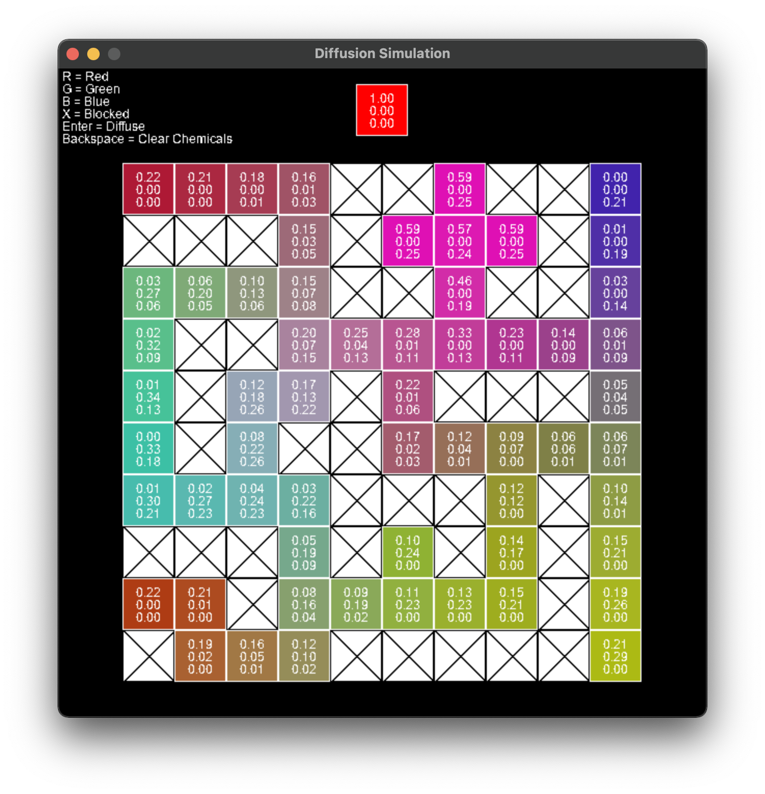

# Diffusion Simulation

Visualization tool for Programming and Problem Solving Project 1

## Project 1: Chemotaxis Revisited

### Course Summary

Course: COMS 4444 Programming and Problem Solving (Fall 2021)  
Website: http://www.cs.columbia.edu/~kar/4444f21/4444f21.html  
University: Columbia University  
Instructor: Prof. Kenneth Ross  
TA: Griffin Adams

### Project Description

Chemotaxis involves following a gradient in chemical signal concentrations toward reaching a target. Given a set of three chemicals (red, green, and blue), a controller applies chemicals to the map, and agents move in response to chemical stimuli. These chemicals diffuse throughout the grid over time. Further, there may be blocked cells in the grid that agents must move around. Your objective is to move your agents through the map to reach a target location as quickly as possible.

## Diffusion Simulation

  

